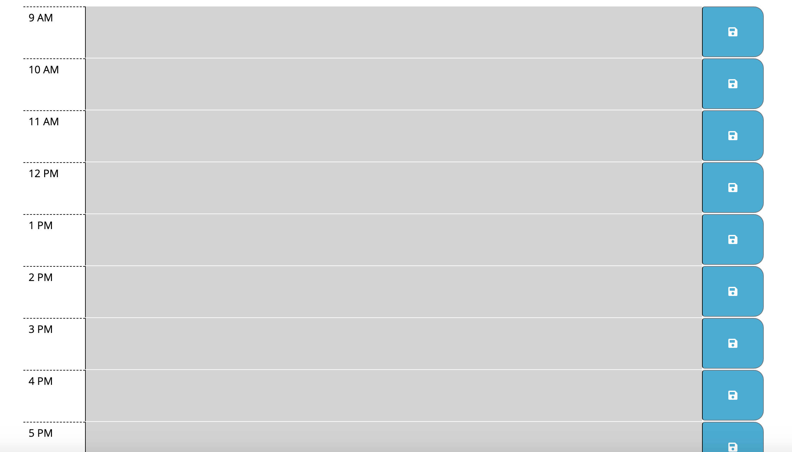

# Code-Quiz

## Website URL: https://sushmakaluva.github.io/Day-Planner/

### Description

* The Day-Planner is a calendar application that allows the user to save events for each hour of the day.

### How does it work?
 
* The app displays standard business hours (9 a.m. to 5 p.m.). 
* Each time slot represents one hour and has the following:
 ** The time
 ** Textarea to hold user input
 ** Save button
* Clicking on the save button will store the time and user input in localStorage.
* Additionally, each hour is color coded to reflect whether the time slot is in the past,present or future.

### Technologies used to build this site:

* HTML5  
* CSS
* Bootstrap
* Javascript
* Jquery
* JSON

### Components used to build this quiz:

+ Moment.js library
+ JSON - Stringify and Parse
+ Bootstrap components - containers,buttons
+ Bootstrap grids - rows and columns 
+ Javascript functions
+ Local Storage variables
+ Strings, Arrays, Loops, Objects

